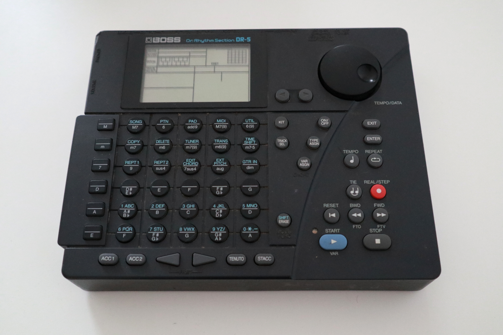

# BOSS DR-5 Samples

## Hardware

## Recording

I recorded all one-shot sample sounds of the DR-5 with a ZOOM U-24 and the [MckRecord](https://github.com/HenriCSHC/MckRecord) utility.

## Bassdrum / Kick Sounds

These samples can be found in the folder [BD](BD)

Index | Name               | Filename
------|--------------------|------------------------------------------------------------
1     | Ambient Kick       | [001_Ambient_Kick.wav](BD/001_Ambient_Kick.wav)
2     | Bright Kick        | [002_Bright_Kick.wav](BD/002_Bright_Kick.wav)
3     | Cave Kick          | [003_Cave_Kick.wav](BD/003_Cave_Kick.wav)
4     | Club Kick          | [004_Club_Kick.wav](BD/004_Club_Kick.wav)
5     | Dance Kick         | [005_Dance_Kick.wav](BD/005_Dance_Kick.wav)
6     | Dark Kick          | [006_Dark_Kick.wav](BD/006_Dark_Kick.wav)
7     | Deep Kick          | [007_Deep_Kick.wav](BD/007_Deep_Kick.wav)
8     | Dig Kick           | [008_Dig_Kick.wav](BD/008_Dig_Kick.wav)
9     | Dry Kick           | [009_Dry_Kick.wav](BD/009_Dry_Kick.wav)
10    | Electronic Kick 1  | [010_Electronic_Kick_1.wav](BD/010_Electronic_Kick_1.wav)
11    | Electronic Kick 2  | [011_Electronic_Kick_2.wav](BD/011_Electronic_Kick_2.wav)
12    | Flop Kick          | [012_Flop_Kick.wav](BD/012_Flop_Kick.wav)
13    | Gate Kick 1        | [013_Gate_Kick_1.wav](BD/013_Gate_Kick_1.wav)
14    | Gate Kick 2        | [014_Gate_Kick_2.wav](BD/014_Gate_Kick_2.wav)
15    | Hall Kick          | [015_Hall_Kick.wav](BD/015_Hall_Kick.wav)
16    | Hard Kick          | [016_Hard_Kick.wav](BD/016_Hard_Kick.wav)
17    | House Kick 1       | [017_House_Kick_1.wav](BD/017_House_Kick_1.wav)
18    | House Kick 2       | [018_House_Kick_2.wav](BD/018_House_Kick_2.wav)
19    | Maple Kick         | [019_Maple_Kick.wav](BD/019_Maple_Kick.wav)
20    | Mondo Kick         | [020_Mondo_Kick.wav](BD/020_Mondo_Kick.wav)
21    | Monster Kick       | [021_Monster_Kick.wav](BD/021_Monster_Kick.wav)
22    | Muffle Kick        | [022_Muffle_Kick.wav](BD/022_Muffle_Kick.wav)
23    | Real Kick          | [023_Real_Kick.wav](BD/023_Real_Kick.wav)
24    | Reverb Kick        | [024_Reverb_Kick.wav](BD/024_Reverb_Kick.wav)
25    | Room Kick          | [025_Room_Kick.wav](BD/025_Room_Kick.wav)
26    | Rubber Kick        | [026_Rubber_Kick.wav](BD/026_Rubber_Kick.wav)
27    | Soft Kick 1        | [027_Soft_Kick_1.wav](BD/027_Soft_Kick_1.wav)
28    | Soft Kick 2        | [028_Soft_Kick_2.wav](BD/028_Soft_Kick_2.wav)
29    | Solid Kick         | [029_Solid_Kick.wav](BD/029_Solid_Kick.wav)
30    | TR-808 Kick        | [030_TR-808_Kick.wav](BD/030_TR-808_Kick.wav)
31    | TR-909 Kick        | [031_TR-909_Kick.wav](BD/031_TR-909_Kick.wav)
32    | Tight Kick         | [032_Tight_Kick.wav](BD/032_Tight_Kick.wav)

## Snare Drum Sounds

These samples can be found in the folder [SD](SD)

Index | Name               | Filename
------|--------------------|------------------------------------------------------------
1 | Acoustic Snare 1 | [001_Acoustic_Snare_1.wav](SD/001_Acoustic_Snare_1.wav)
2 | Acoustic Snare 2 | [002_Acoustic_Snare_2.wav](SD/002_Acoustic_Snare_2.wav)
3 | Brush Roll Snare | [003_Brush_Roll_Snare.wav](SD/003_Brush_Roll_Snare.wav)
4 | Brush Slap Snare 1 | [004_Brush_Slap_Snare_1.wav](SD/004_Brush_Slap_Snare_1.wav)
5 | Brush Slap Snare 2 | [005_Brush_Slap_Snare_2.wav](SD/005_Brush_Slap_Snare_2.wav)
6 | Brush Swish Snare | [006_Brush_Swish_Snare.wav](SD/006_Brush_Swish_Snare.wav)
7 | Cool Snare | [007_Cool_Snare.wav](SD/007_Cool_Snare.wav)
8 | Dance Snare | [008_Dance_Snare.wav](SD/008_Dance_Snare.wav)
9 | Dopin Snare | [009_Dopin_Snare.wav](SD/009_Dopin_Snare.wav)
10 | Double Snare | [010_Double_Snare.wav](SD/010_Double_Snare.wav)
11 | Electronic Snare | [011_Electronic_Snare.wav](SD/011_Electronic_Snare.wav)
12 | Fat Snare | [012_Fat_Snare.wav](SD/012_Fat_Snare.wav)
13 | Grab Snare | [013_Grab_Snare.wav](SD/013_Grab_Snare.wav)
14 | House Snare | [014_House_Snare.wav](SD/014_House_Snare.wav)
15 | House Dopin Snare | [015_House_Dopin_Snare.wav](SD/015_House_Dopin_Snare.wav)
16 | Kettle Snare | [016_Kettle_Snare.wav](SD/016_Kettle_Snare.wav)
17 | LA Snare | [017_LA_Snare.wav](SD/017_LA_Snare.wav)
18 | Loose Snare | [018_Loose_Snare.wav](SD/018_Loose_Snare.wav)
19 | Maple Snare | [019_Maple_Snare.wav](SD/019_Maple_Snare.wav)
20 | Noise Snare | [020_Noise_Snare.wav](SD/020_Noise_Snare.wav)
21 | Nashville Snare | [021_Nashville_Snare.wav](SD/021_Nashville_Snare.wav)
22 | Piccolo Snare | [022_Piccolo_Snare.wav](SD/022_Piccolo_Snare.wav)
23 | Radio Snare | [023_Radio_Snare.wav](SD/023_Radio_Snare.wav)
24 | Rock Rim Shot Snare | [024_Rock_Rim_Shot_Snare.wav](SD/024_Rock_Rim_Shot_Snare.wav)
25 | Real Snare 1 | [025_Real_Snare_1.wav](SD/025_Real_Snare_1.wav)
26 | Real Snare 2 | [026_Real_Snare_2.wav](SD/026_Real_Snare_2.wav)
27 | Real Snare 3 | [027_Real_Snare_3.wav](SD/027_Real_Snare_3.wav)
28 | Reggae Snare 1 | [028_Reggae_Snare_1.wav](SD/028_Reggae_Snare_1.wav)
29 | Reggae Snare 2 | [029_Reggae_Snare_2.wav](SD/029_Reggae_Snare_2.wav)
30 | Ring Snare | [030_Ring_Snare.wav](SD/030_Ring_Snare.wav)
31 | Room Gated Snare | [031_Room_Gated_Snare.wav](SD/031_Room_Gated_Snare.wav)
32 | Rock Snare | [032_Rock_Snare.wav](SD/032_Rock_Snare.wav)
33 | Slam Snare | [033_Slam_Snare.wav](SD/033_Slam_Snare.wav)
34 | Spout Snare | [034_Spout_Snare.wav](SD/034_Spout_Snare.wav)
35 | Stick Snare | [035_Stick_Snare.wav](SD/035_Stick_Snare.wav)
36 | TR-808 Snare | [036_TR-808_Snare.wav](SD/036_TR-808_Snare.wav)
37 | TR-909 Snare | [037_TR-909_Snare.wav](SD/037_TR-909_Snare.wav)
38 | Tight Snare | [038_Tight_Snare.wav](SD/038_Tight_Snare.wav)
39 | Tiny Snare | [039_Tiny_Snare.wav](SD/039_Tiny_Snare.wav)
40 | Wood Snare | [040_Wood_Snare.wav](SD/040_Wood_Snare.wav)
41 | Ambient Side Stick | [041_Ambient_Side_Stick.wav](SD/041_Ambient_Side_Stick.wav)
42 | TR-808 Side Stick | [042_TR-808_Side_Stick.wav](SD/042_TR-808_Side_Stick.wav)

## Tom Sounds

These samples can be found in the folder [TOMS](TOMS)

Index | Name               | Filename
------|--------------------|------------------------------------------------------------
1   |   Ambient Tom 1   | [001_Ambient_Tom_1.wav](TOMS/001_Ambient_Tom_1.wav)
2   |   Ambient Tom 2   | [002_Ambient_Tom_2.wav](TOMS/002_Ambient_Tom_2.wav)
3   |   Ambient Tom 3   | [003_Ambient_Tom_3.wav](TOMS/003_Ambient_Tom_3.wav)
4   |   Ambient Tom 4   | [004_Ambient_Tom_4.wav](TOMS/004_Ambient_Tom_4.wav)
5   |   Bend Tom 1  | [005_Bend_Tom_1.wav](TOMS/005_Bend_Tom_1.wav)
6   |   Bend Tom 2  | [006_Bend_Tom_2.wav](TOMS/006_Bend_Tom_2.wav)
7   |   Bend Tom 3  | [007_Bend_Tom_3.wav](TOMS/007_Bend_Tom_3.wav)
8   |   Bend Tom 4  | [008_Bend_Tom_4.wav](TOMS/008_Bend_Tom_4.wav)
9   |   Brush Tom 1 | [009_Brush_Tom_1.wav](TOMS/009_Brush_Tom_1.wav)
10  |   Brush Tom 2 | [010_Brush_Tom_2.wav](TOMS/010_Brush_Tom_2.wav)
11  |   Brush Tom 3 | [011_Brush_Tom_3.wav](TOMS/011_Brush_Tom_3.wav)
12  |   Brush Tom 4 | [012_Brush_Tom_4.wav](TOMS/012_Brush_Tom_4.wav)
13  |   Double Head Tom 1   | [013_Double_Head_Tom_1.wav](TOMS/013_Double_Head_Tom_1.wav)
14  |   Double Head Tom 2   | [014_Double_Head_Tom_2.wav](TOMS/014_Double_Head_Tom_2.wav)
15  |   Double Head Tom 3   | [015_Double_Head_Tom_3.wav](TOMS/015_Double_Head_Tom_3.wav)
16  |   Double Head Tom 4   | [016_Double_Head_Tom_4.wav](TOMS/016_Double_Head_Tom_4.wav)
17  |   Rim Tom 1   | [017_Rim_Tom_1.wav](TOMS/017_Rim_Tom_1.wav)
18  |   Rim Tom 2   | [018_Rim_Tom_2.wav](TOMS/018_Rim_Tom_2.wav)
19  |   Rim Tom 3   | [019_Rim_Tom_3.wav](TOMS/019_Rim_Tom_3.wav)
20  |   Rim Tom 4   | [020_Rim_Tom_4.wav](TOMS/020_Rim_Tom_4.wav)
21  |   Rock Tom 1  | [021_Rock_Tom_1.wav](TOMS/021_Rock_Tom_1.wav)
22  |   Rock Tom 2  | [022_Rock_Tom_2.wav](TOMS/022_Rock_Tom_2.wav)
23  |   Rock Tom 3  | [023_Rock_Tom_3.wav](TOMS/023_Rock_Tom_3.wav)
24  |   Rock Tom 4  | [024_Rock_Tom_4.wav](TOMS/024_Rock_Tom_4.wav)
25  |   TR-808 Tom 1    | [025_TR_808_Tom_1.wav](TOMS/025_TR_808_Tom_1.wav)
26  |   TR-808 Tom 2    | [026_TR_808_Tom_2.wav](TOMS/026_TR_808_Tom_2.wav)

## Hi-Hat and Cymbal Sounds

These samples can be found in the folder [HATS](HATS)

Index | Name               | Filename
------|--------------------|------------------------------------------------------------
001 |   Acoustic Closed Hi-hat  |   [001_Acoustic_Closed_Hi-hat.wav](HATS/001_Acoustic_Closed_Hi-hat.wav)
002 |   Acoustic Open Hi-hat    |   [002_Acoustic_Open_Hi-hat.wav](HATS/002_Acoustic_Open_Hi-hat.wav)
003 |   Acoustic Pedal Hi-hat   |   [003_Acoustic_Pedal_Hi-hat.wav](HATS/003_Acoustic_Pedal_Hi-hat.wav)
004 |   Heavy Closed Hi-hat |   [004_Heavy_Closed_Hi-hat.wav](HATS/004_Heavy_Closed_Hi-hat.wav)
005 |   Heavy Open Hi-hat   |   [005_Heavy_Open_Hi-hat.wav](HATS/005_Heavy_Open_Hi-hat.wav)
006 |   Pop Closed Hi-hat   |   [006_Pop_Closed_Hi-hat.wav](HATS/006_Pop_Closed_Hi-hat.wav)
007 |   Pop Open Hi-hat |   [007_Pop_Open_Hi-hat.wav](HATS/007_Pop_Open_Hi-hat.wav)
008 |   Pop Pedal Hi-hat    |   [008_Pop_Pedal_Hi-hat.wav](HATS/008_Pop_Pedal_Hi-hat.wav)
009 |   TR-808 Closed Hi-hat    |   [009_TR_808_Closed_Hi-hat.wav](HATS/009_TR_808_Closed_Hi-hat.wav)
010 |   TR-808 Open Hi-hat  |   [010_TR_808_Open_Hi-hat.wav](HATS/010_TR_808_Open_Hi-hat.wav)
011 |   Crash Cymbal 1  |   [011_Crash_Cymbal_1.wav](HATS/011_Crash_Cymbal_1.wav)
012 |   Crash Cymbal 2  |   [012_Crash_Cymbal_2.wav](HATS/012_Crash_Cymbal_2.wav)
013 |   Ride Bell Cymbal    |   [013_Ride_Bell_Cymbal.wav](HATS/013_Ride_Bell_Cymbal.wav)
014 |   Ride Cymbal |   [014_Ride_Cymbal.wav](HATS/014_Ride_Cymbal.wav)
015 |   Rock Ride Bell Cymbal   |   [015_Rock_Ride_Bell_Cymbal.wav](HATS/015_Rock_Ride_Bell_Cymbal.wav)
016 |   Rock Ride Cymbal    |   [016_Rock_Ride_Cymbal.wav](HATS/016_Rock_Ride_Cymbal.wav)
017 |   Splash Cymbal   |   [017_Splash_Cymbal.wav](HATS/017_Splash_Cymbal.wav)

## Percussion Sounds

These samples can be found in the folder [PERC](PERC)

Index | Name               | Filename
------|--------------------|------------------------------------------------------------
1   |   Cowbell |   [001_Cowbell.wav](PERC/001_Cowbell.wav)
2   |   Tambourine  |   [002_Tambourine.wav](PERC/002_Tambourine.wav)
3   |   Hall Castanets  |   [003_Hall_Castanets.wav](PERC/003_Hall_Castanets.wav)
4   |   Sleigh Bell |   [004_Sleigh_Bell.wav](PERC/004_Sleigh_Bell.wav)
5   |   Triangle Mute   |   [005_Triangle_Mute.wav](PERC/005_Triangle_Mute.wav)
6   |   Triangle Open   |   [006_Triangle_Open.wav](PERC/006_Triangle_Open.wav)
7   |   Wood Block  |   [007_Wood_Block.wav](PERC/007_Wood_Block.wav)
8   |   Bongo High  |   [008_Bongo_High.wav](PERC/008_Bongo_High.wav)
9   |   Bongo Low   |   [009_Bongo_Low.wav](PERC/009_Bongo_Low.wav)
10  |   Conga High Mute |   [010_Conga_High_Mute.wav](PERC/010_Conga_High_Mute.wav)
11  |   Conga High Slap |   [011_Conga_High_Slap.wav](PERC/011_Conga_High_Slap.wav)
12  |   Conga High Open |   [012_Conga_High_Open.wav](PERC/012_Conga_High_Open.wav)
13  |   Conga Low Open  |   [013_Conga_Low_Open.wav](PERC/013_Conga_Low_Open.wav)
14  |   Timbale |   [014_Timbale.wav](PERC/014_Timbale.wav)
15  |   Claves  |   [015_Claves.wav](PERC/015_Claves.wav)
16  |   Vibra-slap  |   [016_Vibra-slap.wav](PERC/016_Vibra-slap.wav)
17  |   Guiro Short |   [017_Guiro_Short.wav](PERC/017_Guiro_Short.wav)
18  |   Guiro Long  |   [018_Guiro_Long.wav](PERC/018_Guiro_Long.wav)
19  |   Maracas |   [019_Maracas.wav](PERC/019_Maracas.wav)
20  |   Shaker  |   [020_Shaker.wav](PERC/020_Shaker.wav)
21  |   Cabasa  |   [021_Cabasa.wav](PERC/021_Cabasa.wav)
22  |   Whistle Short   |   [022_Whistle_Short.wav](PERC/022_Whistle_Short.wav)
23  |   Whistle Long    |   [023_Whistle_Long.wav](PERC/023_Whistle_Long.wav)
24  |   Agogo   |   [024_Agogo.wav](PERC/024_Agogo.wav)
25  |   Cuica   |   [025_Cuica.wav](PERC/025_Cuica.wav)
26  |   Pandiero Open   |   [026_Pandiero_Open.wav](PERC/026_Pandiero_Open.wav)
27  |   Pandiero Mute   |   [027_Pandiero_Mute.wav](PERC/027_Pandiero_Mute.wav)
28  |   Surdo Open  |   [028_Surdo_Open.wav](PERC/028_Surdo_Open.wav)
29  |   Surdo Mute  |   [029_Surdo_Mute.wav](PERC/029_Surdo_Mute.wav)
30  |   Tamborim    |   [030_Tamborim.wav](PERC/030_Tamborim.wav)
31  |   CR-78 Cowbell   |   [031_CR-78_Cowbell.wav](PERC/031_CR-78_Cowbell.wav)
32  |   CR-78 Metallic Beat |   [032_CR-78_Metallic_Beat.wav](PERC/032_CR-78_Metallic_Beat.wav)
33  |   CR-78 Guiro |   [033_CR-78_Guiro.wav](PERC/033_CR-78_Guiro.wav)
34  |   CR-78 Tambourine    |   [034_CR-78_Tambourine.wav](PERC/034_CR-78_Tambourine.wav)
35  |   TR-808 Clap |   [035_TR-808_Clap.wav](PERC/035_TR-808_Clap.wav)
36  |   TR-808 Cowbell  |   [036_TR-808_Cowbell.wav](PERC/036_TR-808_Cowbell.wav)
37  |   TR-808 Conga    |   [037_TR-808_Conga.wav](PERC/037_TR-808_Conga.wav)

## Effect Sounds

These samples can be found in the folder [FX](FX)

Index | Name               | Filename
------|--------------------|------------------------------------------------------------
1   |   Flex    |   [001_Flex.wav](FX/001_Flex.wav)
2   |   Flip    |   [002_Flip.wav](FX/002_Flip.wav)
3   |   Gong    |   [003_Gong.wav](FX/003_Gong.wav)
4   |   High Q  |   [004_High_Q.wav](FX/004_High_Q.wav)
5   |   Knocker |   [005_Knocker.wav](FX/005_Knocker.wav)
6   |   Scratch Pull    |   [006_Scratch_Pull.wav](FX/006_Scratch_Pull.wav)
7   |   Scratch Push    |   [007_Scratch_Push.wav](FX/007_Scratch_Push.wav)
8   |   Snaps   |   [008_Snaps.wav](FX/008_Snaps.wav)
9   |   Storm   |   [009_Storm.wav](FX/009_Storm.wav)
10  |   Bass Slide  |   [010_Bass_Slide.wav](FX/010_Bass_Slide.wav)
11  |   Guitar Scrape 1 |   [011_Guitar_Scrape_1.wav](FX/011_Guitar_Scrape_1.wav)
12  |   Guitar Scrape 2 |   [012_Guitar_Scrape_2.wav](FX/012_Guitar_Scrape_2.wav)
13  |   Guitar Scrape 3 |   [013_Guitar_Scrape_3.wav](FX/013_Guitar_Scrape_3.wav)
14  |   Reverse Kick    |   [014_Reverse_Kick.wav](FX/014_Reverse_Kick.wav)
15  |   Reverse Snare   |   [015_Reverse_Snare.wav](FX/015_Reverse_Snare.wav)
16  |   Reverse Tom |   [016_Reverse_Tom.wav](FX/016_Reverse_Tom.wav)
17  |   Reverse Cymbal  |   [017_Reverse_Cymbal.wav](FX/017_Reverse_Cymbal.wav)
18  |   Reverse Clap    |   [018_Reverse_Clap.wav](FX/018_Reverse_Clap.wav)
19  |   Reverse Beat    |   [019_Reverse_Beat.wav](FX/019_Reverse_Beat.wav)
20  |   Reverse Tambourine  |   [020_Reverse_Tambourine.wav](FX/020_Reverse_Tambourine.wav)